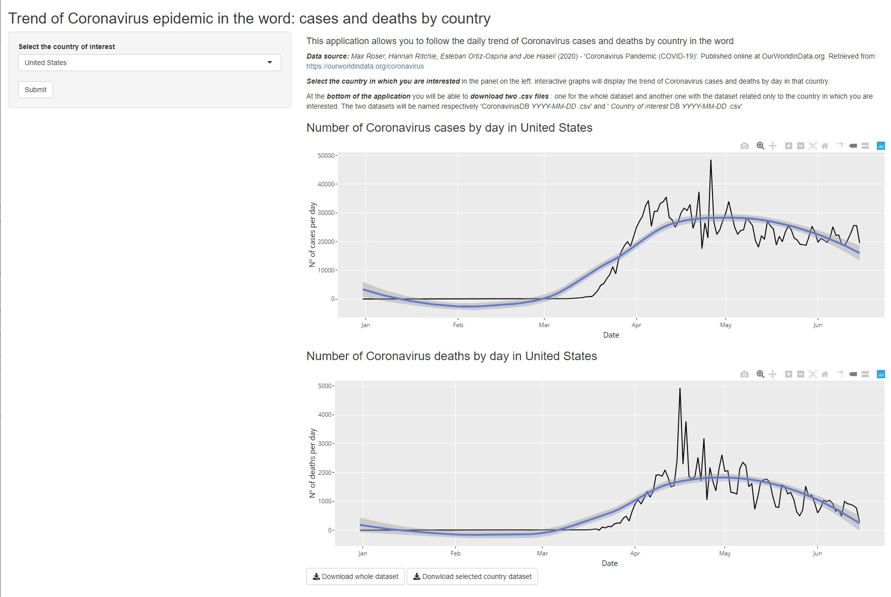

```{r setup, include=FALSE}
knitr::opts_chunk$set(echo = FALSE)
```

## The Application

- **Objective**: following the trend the Coronavirus epidemic in the different countries in the word.
- **Features**: 
    + Automatic update of the underlying dataset
    + Selection of the Country of Interest
    + Allowing dowload of the datasets
    
## How the App is built
- Download dataset: [*Max Roser, Hannah Ritchie, Esteban Ortiz-Ospina and Joe Hasell* (2020)](https://ourworldindata.org/coronavirus)
- Dropdown list created allowing select Country of interest
```{r, eval=FALSE, echo=TRUE}
countries <- prepareCountryList(coronavirus)
```
- Generation Reactive interactive Graps on number of cases and deaths by day
```{r, eval=FALSE, echo=TRUE}
observeEvent(eventExpr = input$submit, {
        output$plotCases <- renderPlotly({
            print(ggplotly(ggplot(data = country(), mapping = aes(x = Date, y = Cases)) +
                        geom_line() +
                        geom_smooth() +
                        labs(x = "Date", y = "Nº of cases per day")))})})
```
- Reactive downloads buttons to download datasets of interest

## How the App looks like

{#id .class width=75% height=75%}

## Where to find the App and the related code

- **App**:  the app is available [here](https://cippa.shinyapps.io/developing-data-products/)
    + *Disclaimer*: at first time it may require a bit of time before starting 
    since it has to download the dataset
- **Code**: You can access the code of the application [here](https://github.com/Cippa/Developing-Data-Products/blob/gh-pages/app.R)  

**Thanks for your time!**  
*Fulvio*


